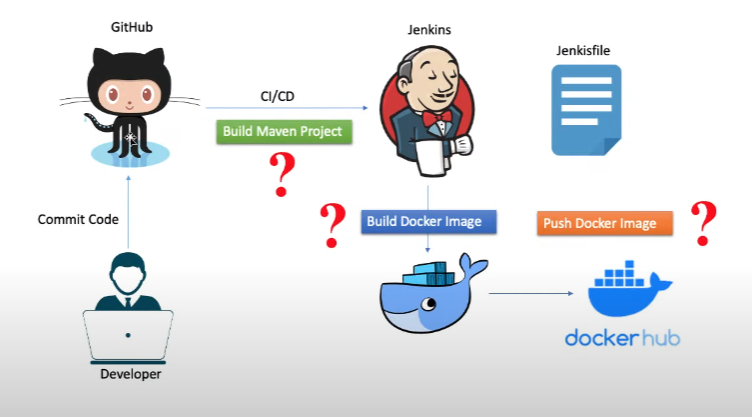

# CI/CD Pipeline with Jenkins, Docker, and Spring Boot

This repository contains a simple Spring Boot application and a Jenkins pipeline for practicing Continuous Integration and Continuous Deployment (CI/CD) using Jenkins, Docker, and GitHub. The Jenkinsfile in this repository automates the build, Docker image creation, and pushing the image to Docker Hub.

## Process

## CI/CD Workflow

The CI/CD workflow in this project consists of the following stages:

1. **Build Maven**: This stage checks out the code from the `main` branch of the GitHub repository and builds the Spring Boot application using Apache Maven.

2. **Build Docker image**: This stage builds a Docker image for the Spring Boot application.

3. **Push image to Docker Hub**: This stage logs in to Docker Hub using Docker credentials and pushes the Docker image to a Docker Hub repository.

## Prerequisites

Before setting up this CI/CD pipeline, ensure you have the following prerequisites:

- Jenkins is installed and configured with the necessary plugins.

- Docker is installed on the Jenkins server.

- Docker Hub account and credentials are set up.

- Jenkins Global credentials with the ID 'dockerhubpwd' for Docker Hub login.

## Jenkins Configuration

1. Create a Jenkins pipeline job and configure it to use the Jenkinsfile provided in this repository.

2. Set up Jenkins global credentials for Docker Hub with the ID 'dockerhubpwd'.

3. Configure the pipeline job to trigger automatically when changes are pushed to your GitHub repository.

## Usage

1. Make changes to your Spring Boot application.

2. Push the changes to your GitHub repository.

3. Jenkins will automatically trigger the CI/CD pipeline based on the Jenkinsfile.

4. Monitor the Jenkins job's console output to track the progress of each stage.

5. Once the pipeline completes successfully, the Docker image will be available on Docker Hub.

## Author

- [IMAD FAOUZI](https://github.com/imadfaouzi)

## Star this Repository
If you find this project helpful or interesting, please consider giving it a star on GitHub. Your support is greatly appreciated!